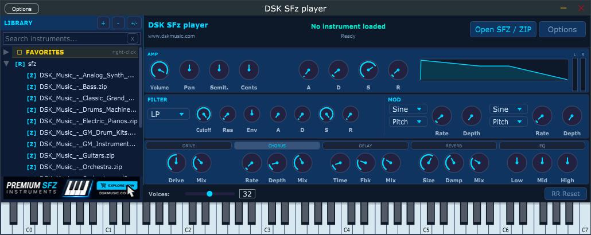

# DSK SFz Player

**DSK SFz Player** is a high-performance, 64-voice polyphonic SFZ sampler. Designed for music producers and sound designers, it provides a seamless workflow for loading SFZ instrument libraries with full MIDI control, flexible modulation, and professional-grade effects.

  

---

## 🚀 Key Features

* **Polyphony:** 64-voice polyphonic engine for rich, layered soundscapes.
* **Versatile Formats:** Works as a **VST3 Plugin** or as a **Standalone Application**.
* **Audio Support:** Compatible with WAV, FLAC, and OGG audio formats inside SFZ files.
* **Drag & Drop Workflow:** Effortlessly load `.sfz` files, folders, or `.zip` packs directly into the plugin.
* **Sound Sculpting:**
    * Amplitude & Filter envelopes.
    * Two versatile LFOs.
    * Five built-in effects.
* **Automation:** Real-time parameter automation for dynamic performances.
* **Customizable Interface:** Fully resizeable window with multiple theme options and tooltips.

---

## 🎹 Quick Start

### Loading Instruments
Getting started with DSK SFz Player is intuitive:

1.  **Drag & Drop:** Simply drag an `.sfz` file, a folder containing instruments, or a `.zip` library pack onto the plugin window.
2.  **Open Button:** Use the "Open SFZ / ZIP" button to browse your local files.
3.  **Library Tree:** Organize your collections using the built-in Library panel. Double-click any entry to load it immediately.

### Playability
* **MIDI Ready:** Connect your favorite MIDI controller or use your PC keyboard to trigger notes.
* **Parameter Control:** Right-click on any knob to enter precise values or reset parameters.
* **Global Config:** Export and import your library paths, favorites, and theme settings as `.json` files.

---

## 🛠 Tech Stack
Built with C++ and the [JUCE Framework](https://juce.com/).

---

## 📦 Installation & System Requirements
* **Formats:** VST3, Standalone.
* **Operating Systems:** macOS, Windows, Linux.
* *Check the latest releases for binary downloads.*

---

## 📄 Documentation
For a detailed guide on all features, MIDI mapping, and configuration, please refer to the `manual.md` file included in this repository.

---

## Downloads
[Click here to download the latest version](https://github.com/dskmusic/DSKSFzPlayer/releases/latest)
---

## 🔗 Links
* **Official Website:** [www.dskmusic.com](http://www.dskmusic.com)

---
*Developed by DSK Music.*
*Made with ❤️ in Gran Canaria, Spain.*
